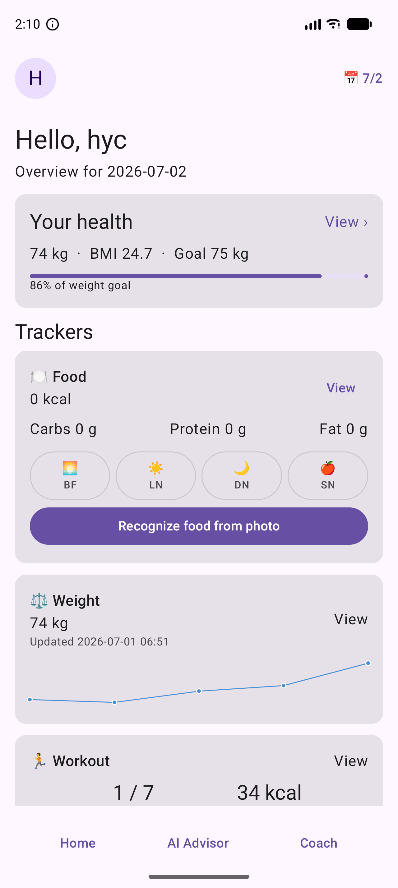
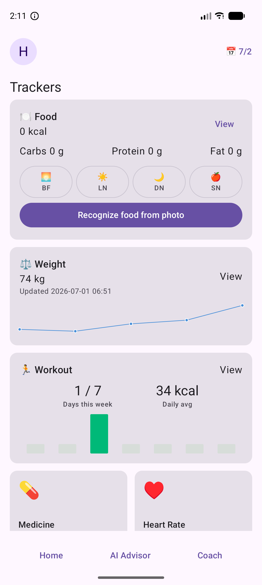
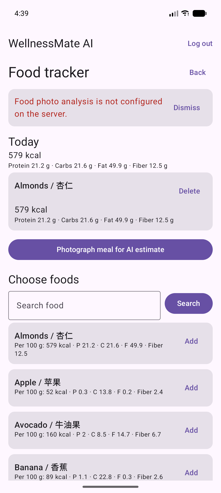
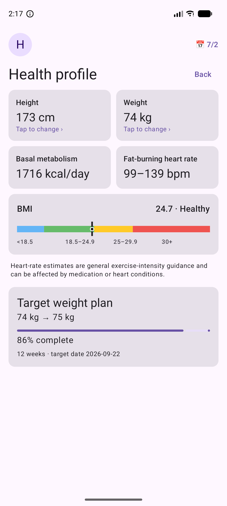

# WellnessMate AI

WellnessMate AI is a full-stack mobile health and fitness application. It combines an Android client, a Spring Boot backend, tracker data storage, coach-plan workflows, coach messaging, and AI-assisted wellness features.

The app is designed around a simple daily loop: users complete onboarding, record health data, review visual tracker summaries, receive AI-supported advice, and communicate with coaches or follow training plans.

> This project is for wellness tracking and coursework demonstration. It does not provide medical diagnosis, prescription, emergency guidance, or clinical treatment.

## Screenshots

<p align="center">
  
  
  
  
</p>

| Home overview | Tracker cards | Food tracker | Health profile |
|---|---|---|---|
| Daily health summary, selected date, food/weight/workout entry points. | Compact tracker cards with charts and optional tracker tiles. | Food catalog, nutrition totals, photo-recognition entry point. | Height, weight, BMR, BMI range, fat-burning heart-rate estimate, target progress. |

## Key features

- Account registration, login, JWT session restore, logout, and first-login onboarding.
- Onboarding questionnaire for basic user profile data, goal weight, target period, daily routine, sport preference, and app needs.
- Home dashboard with selected-date data, health summary card, and tracker entry points.
- Built-in trackers for food, weight, workout, steps, sleep, water, medicine, heart rate, and blood glucose.
- Food tracker with meal sections, built-in food catalog, serving-size selection, nutrition calculation, and photo-based food recognition entry.
- Weight tracker with daily single-record behavior and seven-day chart visualization.
- Workout tracker with weekly activity summary, calorie chart, and exercise selection flow.
- Health profile page with calculated BMI, basal metabolism estimate, fat-burning heart-rate range, and weight-goal progress.
- AI Advisor chat module with persisted sessions and backend-side context from user profile and tracker history.
- Training plan module for coach-published plans, user check-ins, coach contact, and plan subscription state.
- Coach chat module with user/coach conversation isolation and unread-message indicators.
- Backend deployment through Docker Compose, MySQL, Caddy HTTPS reverse proxy, and a DigitalOcean Droplet test server.

## Tech stack

### Android client

- Kotlin
- Jetpack Compose
- Navigation Compose
- ViewModel + Kotlin coroutines
- Retrofit / OkHttp
- Encrypted local token storage
- CameraX for food-photo capture

### Backend

- Java 21
- Spring Boot
- Spring Security with JWT
- Spring Data JPA / Hibernate
- Flyway database migrations
- MySQL 8.4 in production-style deployment
- H2 for integration tests
- Maven

### AI and deployment

- AI chat and food-photo analysis use an OpenAI-compatible Chat Completions style backend integration.
- Food image nutrition estimation supports Volcengine Doubao Ark model APIs.
- API keys are backend-only and must not be embedded in the Android app.
- Cloud test deployment uses DigitalOcean Droplet + Docker Compose + Caddy HTTPS.

## Repository layout

```text
android-app/     Android Kotlin + Jetpack Compose client
backend/         Java Spring Boot backend
docs/            Technical documents and README screenshots
icons/           App and UI icon assets
scripts/         Helper scripts for deployment and testing
dist/            Locally generated APK artifacts, if present
```

## Local setup

### 1. Prepare environment

Required tools:

- Java 21
- Android Studio with Android SDK / AVD
- Docker Desktop
- Git

### 2. Configure backend environment

```powershell
Copy-Item .env.example .env
```

Edit `.env` for local secrets and optional AI settings. Do not commit `.env`.

### 3. Start backend locally

```powershell
docker compose up --build
```

Backend health check:

```text
http://localhost:18080/actuator/health
```

### 4. Run Android app

Open `android-app/` in Android Studio, select an emulator, and run the `app` configuration.

For an emulator calling the local backend, build with:

```powershell
cd android-app
.\gradlew.bat :app:assembleDebug -PAPI_BASE_URL=http://10.0.2.2:18080/
```

For the cloud backend, build with:

```powershell
cd android-app
.\gradlew.bat :app:assembleDebug -PAPI_BASE_URL=https://api.hdx-lab.org/
```

## Validation

Run backend tests:

```powershell
cd backend
.\mvnw.cmd test
```

Compile Android debug Kotlin:

```powershell
cd android-app
.\gradlew.bat :app:compileDebugKotlin
```

## Security notes

- Do not commit `.env`, API keys, JWT secrets, database volumes, local build outputs, or signing credentials.
- AI calls are routed through the backend so mobile clients do not receive model API keys.
- User-owned tracker data and chat data should be accessed only through authenticated backend APIs.

## Project status

The current version implements the core Android wellness loop, backend account/tracker/chat/plan APIs, AI Advisor integration points, food-photo nutrition analysis support, and cloud deployment workflow. Remaining production work would include stronger privacy controls, broader device testing, App Store style release signing, monitoring, and formal medical-safety review if the app were expanded beyond coursework use.
