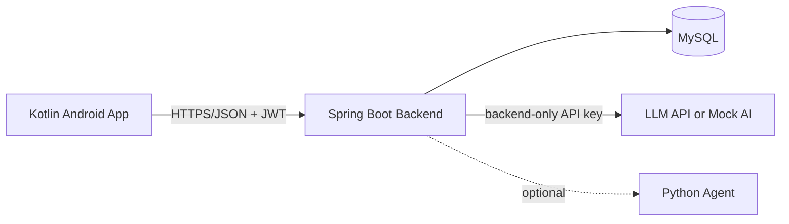
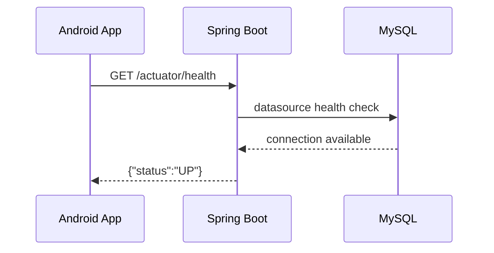

# Architecture

## System context

The backend is a modular monolith. Domain packages will be `auth`, `wellness`, `chat`, `recommendation`, and `common`. This keeps deployment and demonstrations reliable while retaining explicit module boundaries.

## Frozen stage 1 decisions

- Java 21 and Spring Boot 3.5.12.
- MySQL 8.4, Flyway migrations, and Hibernate `ddl-auto=validate`.
- Kotlin, Jetpack Compose, Material 3, ViewModel, StateFlow, Retrofit, and Moshi.
- AGP 9.2, compile API 36.1, target API 36, and provisional minimum API 26.
- UTC instants for audit timestamps and `LocalDate` semantics for wellness record dates.
- LLM credentials remain on the backend. Mock AI will support development without credentials.

## Security boundaries

- Android never sends or chooses a `userId` for protected resources.
- The backend derives ownership from the verified JWT subject.
- Every record, chat session, and recommendation query is scoped to the authenticated user.
- Debug HTTP is allowed only for emulator development; release configuration requires HTTPS.
- Chat context contains only the minimum recent wellness summary needed for the response.

## Stage 1 acceptance path

